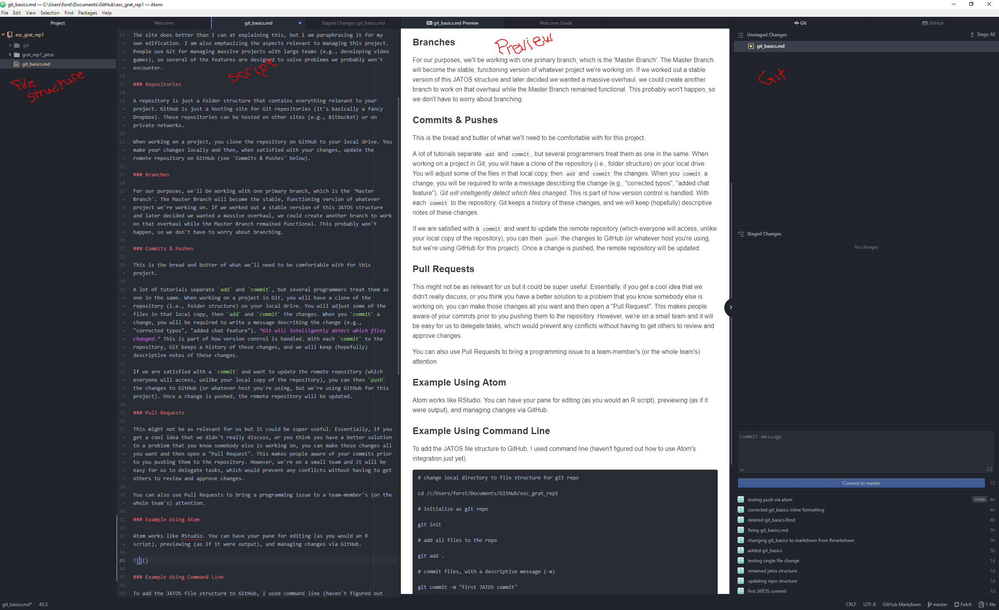

### New GitHub Structure

JATOS has defaults that make it difficult to build a study from a sub-folder of a larger project. This is somewhat difficult to articulate, but the JATOS structure needs to match the file structure of the GitHub repo if we want to collaborate this way.

We should all take the following steps on our local machines:

*In JATOS*

1. Create a 'New Study' and call it 'grat_rep1'.

* This will create a folder within `study_assets_root` called `grat_rep1`.

2. Delete the folder created by JATOS.

*In ATOM*

3. Open the `study_assets_root` folder.

4. Clone the GitHub repo from https://github.com/ejpedersen/grat_rep1

Now JATOS and GitHub will be referencing the same working directory on your folder. This will make collaborating on code seamless. Without taking these steps, you would have to drag changed files from the repository into the folder created in `study_assets_root`. That's no fun. Now all you have to do to get JATOS to recognize the most recent version is to use `git pull`.

*I updated all file paths for scripts to reference `grat_rep1` instead of `gratitude` because you will now be working from a different folder name.*

### GitHub Support

Once you have the 4 steps above figured out, you will not have to repeat them (unless you delete everything).

Below is the text from the previous 'instruction' document so you can use it as a reference.

#### Software

Atom: atom.io

*Atom allows editing and real-time updating of HTML (and other formatted) previews. It is also integrated with Git and GitHub, so you can easily update the repository as you make changes.*

#### Workflow

This link has information on workflow in GitHub, which should apply to Git repositories in general:

https://guides.github.com/introduction/flow/

The site does better than I can at explaining this, but I am paraphrasing it for my own edification. I am also emphasizing the aspects relevant to managing this project. People use Git for managing massive projects with large teams (e.g., developing video games), so several of the features are designed to solve problems we probably won't encounter.

##### Repositories

A repository is just a folder structure that contains everything relevant to your project. GitHub is just a hosting site for Git repositories (it's basically a fancy Dropbox). These repositories can be hosted on other sites (e.g., Bitbucket) or on private networks.

When working on a project, you clone the repository on GitHub to your local drive. You make your changes locally and then, when satisfied with your changes, update the remote repository on GitHub (see 'Commits & Pushes' below).

##### Branches

For our purposes, we'll be working with one primary branch, which is the 'Master Branch'. The Master Branch will become the stable, functioning version of whatever project we're working on. If we worked out a stable version of this JATOS structure and later decided we wanted a massive overhaul, we could create another branch to work on that overhaul while the Master Branch remained functional. This probably won't happen, so we don't have to worry about branching.

##### Commits & Pushes

This is the bread and butter of what we'll need to be comfortable with for this project.

A lot of tutorials separate `add` and `commit`, but several programmers treat them as one in the same. When working on a project in Git, you will have a clone of the repository (i.e., folder structure) on your local drive. You will adjust some of the files in that local copy, then `add` and `commit` the changes. When you `commit` a change, you will be required to write a message describing the change (e.g., "corrected typos", "added chat feature"). *Git will intelligently detect which files changed.* This is part of how version control is handled. With each `commit` to the repository, Git keeps a history of these changes, and we will keep (hopefully) descriptive notes of these changes.

If we are satisfied with a `commit` and want to update the remote repository (which everyone will access, unlike your local copy of the repository), you can then `push` the changes to GitHub (or whatever host you're using, but we're using GitHub for this project). Once a change is pushed, the remote repository will be updated.

##### Pull Requests

This might not be as relevant for us but it could be super useful. Essentially, if you get a cool idea that we didn't really discuss, or you think you have a better solution to a problem that you know somebody else is working on, you can make those changes all you want and then open a "Pull Request". This makes people aware of your commits prior to you pushing them to the repository. However, we're on a small team and it will be easy for us to delegate tasks, which would prevent any conflicts without having to get others to review and approve changes.

You can also use Pull Requests to bring a programming issue to a team-member's (or the whole team's) attention.

##### Using Atom

Atom works like RStudio. You can have your pane for editing (as you would an R script), previewing (as if it were output), and managing changes via GitHub.

To set up a 'staged change' (equivalent to `add` in command line), simply save your changes to the script as you normally would (`ctrl + s`), then select the change(s) in 'Unstaged Changes' and press `Enter`.

To `commit`, write your 'Commit message' and press `ctrl + Enter`.

To `push`, select the 'Push' button in the lower-right.
